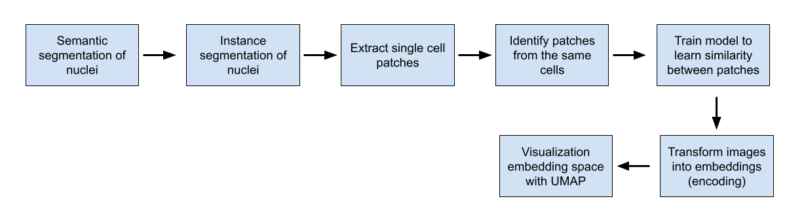
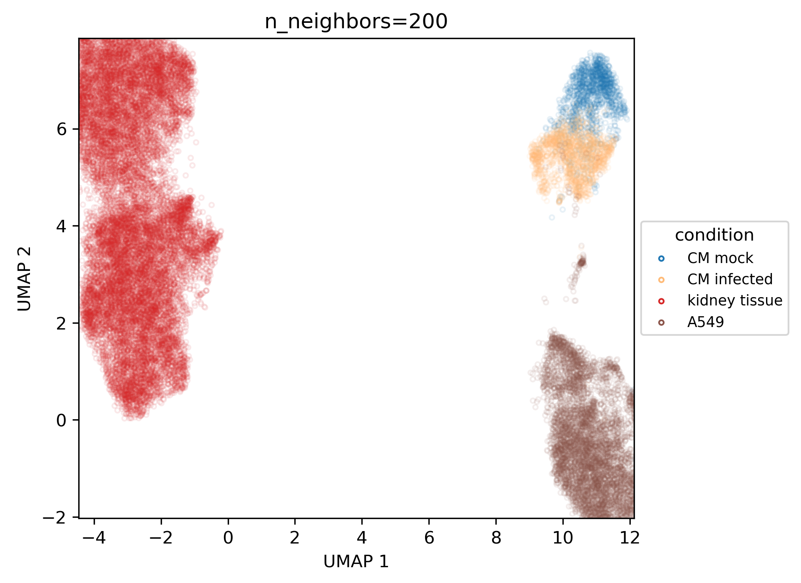

# DynaContrast

Dynacontrast is a pipeline for single cell imaging phenotyping. Dynacontrast uses self-supervised learning to learn a general representation of the cells based on the similarity of cells without labels. The learned representation can then be used to identify cell phenotypes even without prior knowledge of what phenotypes to look for. 

## Dynacontrast pipeline

Example UMAP of representations of 4 cell types. Cells that look similarly are grouped together.  

## Getting Started
